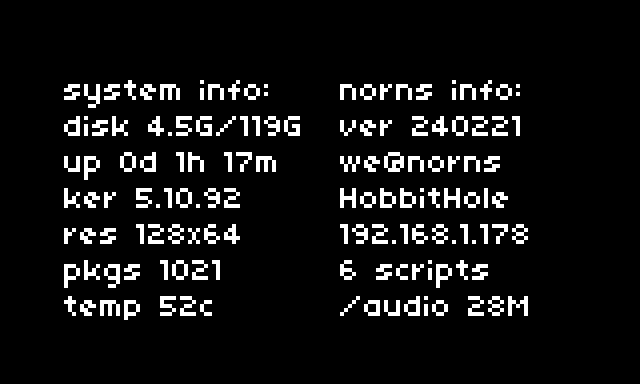

# nornsfetch
> neofetch style system info for norns w/ cute ascii norns

## screenshots

norns ascii

shield ascii 

more info

## features
- user and hostname
- ip address
- uptime
- number of linux packages
- number of scripts installed
- disk space used/total
- screen resolution
- norns release version
- cute ascii norns (:
- more info display adds kernell version, temperature, ssid, and /audio directory size
- **e2** switches between norns or shield ascii art, or a no ascii version that displays more information

## install
in maiden, enter `;install https://github.com/tapecanvas/nornsfetch`

## todo 
- [ ] none currently

### archive
- [x] add to and format "no-ascii" option
  - kernel, temp, ssid, /audio size, 
- [x] add disk info (free/total) entry
- [x] add no-ascii option - display more sys info (longer lines / more verbose, or 2 col readout w/ more entries) 
- [x] [detect factory norns or shield](https://monome.org/docs/norns/api/modules/norns.html) and display appropriate ascii norns
  - instead, I added shield ascii and e2 switches between - your choice 
