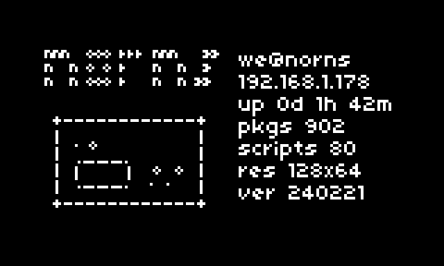
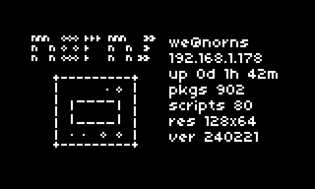

# nornsfetch
> neofetch style system info for norns

## features
- user and hostname
- ip address
- uptime
- number of linux packages
- number of scripts installed
- screen resolution
- norns release version
- cute ascii norns (:

## install
in maiden, enter `;install https://github.com/tapecanvas/nornsfetch`

## todo

### archive
x detect factory norns or shield and display appropriate ascii norns
  - instead, I added shield ascii and e2 switches between - your choice 
